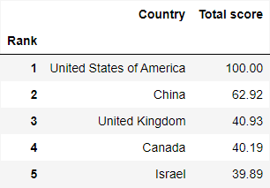
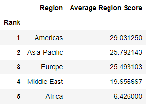
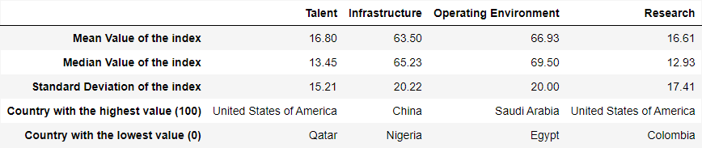
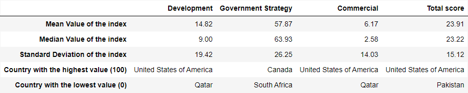

# Project of Data Visualization (COM-480)

| Student's name | SCIPER |
| Quentin Esteban | 288211 |
| Malo Ranzetti | 296956 |
| Anne Silvestre de Sacy| 360399|

[Milestone 1](#milestone-1) • [Milestone 2](#milestone-2) • [Milestone 3](#milestone-3)

## Milestone 1 (29th March, 5pm)

### [FULL REPORT](milestone-1/Data_Visualization_Milestone_1.pdf)

### Dataset
TODO

### Problematic

Given the recent development of the AI industry and its apparent impact on our society, it is relevant to see which countries are the current leading actors and why. The dataset we are using is from the article ["Artificial Intelligence on the World Stage: Dominant Players and Aspiring Challengers"](https://intersog.com/blog/ai-dominant-players-and-aspiring-challengers/).

The main objective of the project is to make an interactive map to efficiently show the different factors which impact a country's capabilities in the AI sector and hence ease the decision making process in this industry. In the storytelling we want to show which countries form leading cliques, with a great importance on the "why?". Our target audience is not only the general public, but individuals from inside the sector, and institutions or governmental agencies likely to have interest in AI. This is why we aim for a sleek, modern and professional look.

### Exploratory Data Analysis

We can directly observe that the data will allow us to build interesting statistics. 

Figure 1 shows the top 5 leading state actors globally. What is interesting is that using the dataset we can construct a ranking of leading regions globally, as shown in Figure 2. 

Finally, we give some more general statistics based on each individual class on which the total score depends, as shown in Figure 3.

Overall, we can see that the individual classes do not have centered means and that there is fluctuating intra-class variance. We will therefore need to communicate this to the target audience. We can also see that coupling this data with another dataset could be very interesting. It is important to note that not all countries of the world are included in the dataset, as we only have 62 entries.

### Related work

Given the leading theme of our project, we found the following works from which we could draw some inspiration.

First, the [AI Global - ‘Where in the World is AI?’ map](https://map.ai-global.org/), also showing data related to AI. This map shows the countries that are using AI in various domains between 2005 and 2021. This map is interesting because it has different colours to show the different domains which we also want to do to have a clear visual distinction between the different indicators we will represent. \autoref{fig:AI_Global}

Then, the [‘Global Conflict Tracker’](https://www.cfr.org/global-conflict-tracker) map. This map doesn’t show data related to AI but to the different conflicts in the world. This map is interesting for its design. The use of soft colours for the map enables to highlight key information with darker tones. Compared to the first one it looks more professional which is more relevant to our project.

This dataset has mainly been used with machine learning prediction algorithms. Our project will be more informative and build on data to highlight the information it gives.

## Milestone 2 (26th April, 5pm)

### [FULL REPORT](milestone-2/Data_Visualization_Milestone_2.pdf)

](http://185.224.139.115:8000/)

## Link to hosted basic skeleton: [http://185.224.139.115:8000/](http://185.224.139.115:8000/)

## General overview

In the previous milestone, we proposed a project which helps visualize the ranking per country regarding the development of AI related technologies, using a multitude of different indicators. We decided that we would build our project around a world map and enhance the user experience through interactions and by superimposing additional graphs and data around the map. As such, we directly implemented a basic skeleton of the web page, as shown in the figure above. 
We center our project around the interactive chloropleth map, which can display the main index as well as the indicators. Users can click on countries to visualize more detailed information as well as a graph showing its position in the global ranking and the distribution of index scores in the dataset. We plan on adding a pop-up toolbar on the left side of the screen giving the user the possibility to explore different indicators or perform filtering operations.

## Implementation steps

- Backend server & frameworks
- World map
- Data display
- Filter menu

## Resources
To make our website we plan to use concepts from most of the COM-480 course. The main lecture used is the one about map visualization: we proceed as in the course, using leaflet.js and converting a shapefile to GeoJSON, we are able to build the desired chloropleth by superimposing content rendered from D3.js.

Most of the other graphs will be designed using courses on D3.js: we might need the lecture about graphs but also data and tabular data. It will help us decide which one suits the data best and what we want to convey. To go further and potentially link the map with the graphs, as well as interact with them, the lecture about interaction will serve us well. Finally, a key factor in effectively sharing information (and engaging our readers) is storytelling and the corresponding lecture. 

## Milestone 3 (31st May, 5pm)

**80% of the final grade**

## Late policy

- < 24h: 80% of the grade for the milestone
- < 48h: 70% of the grade for the milestone

